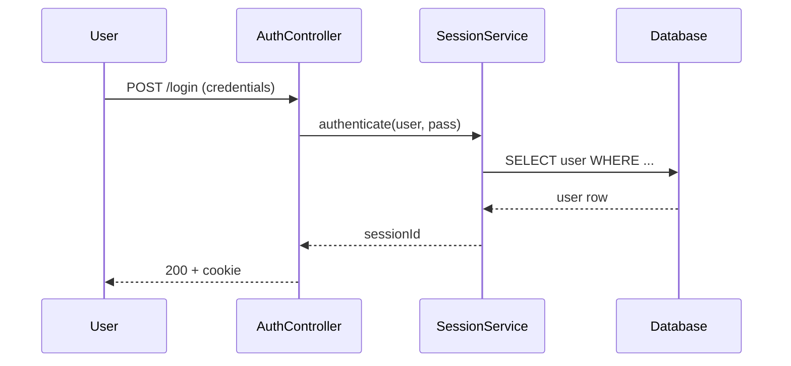

# День 35 — Codebase Explorer: план реализации (БЕЗ имплементации)

> **Статус:** план/анализ. Реализация НЕ выполняется в рамках текущей задачи (по решению пользователя —
> оставить день 35 как design-only, «не реализовывать»).
>
> **Дата плана:** 2026-07-18 (первичная редакция). **Ревизия:** 2026-07-19 — концепция переработана:
> RAG удалён, добавлены три режима вывода, временный клон (session-bound), AST-гибрид,
> обогащённый ленивый индекс.
> **Автор:** cli-agent swarm (неделя 7).

---

## 0. Что изменилось в ревизии 2026-07-19

Концепция дня 35 пересмотрена после критики исходного плана:

| Аспект | Было (первая редакция) | Стало (текущая редакция) |
|---|---|---|
| RAG по коду | ядро (`RagIndexer`, embeddings) | **удалён** — embeddings кода шумные, дорого/медленно, индустрия ушла (Cursor/Claude Code — без pre-built RAG) |
| Клон | постоянный, ради RAG-индекса | **временный, session-bound** — исследовательское средство, удаляется после сессии |
| Swarm / fan-out | ядро (sub-agents по модулям) | **убран из MVP** — дни 31-34 уже показали week-7 паттерны; приоритет — чистый продукт |
| Persistence | векторный индекс | **структурный индекс** (AST-факты + LLM-аннотации топ-пакетов) — дёшево, мало весит |
| AST-стек | kotlin-compiler-embeddable + tree-sitter | **гибрид**: compiler-embeddable для .kt/.java + LLM-extraction для прочих языков |
| Reuse | «переиспользовать максимум» | **избирательный**: только LLM/memory/file-tools, остальное с нуля |
| Scope | «любой репо» | **честный scope**: MVP — репо до ~1000 файлов |

Причина: исходный план страдал cargo cult («переиспользовать всё, что есть»), а RAG для кода —
слабое звено. Подробнее см. критику в истории диалога с пользователем.

---

## 1. Постановка задачи

**Codebase Explorer** — автономный AI-продукт для онбординга в чужой (или свой) код. По URL/пути
git-репозитория агент исследует кодовую базу и отвечает на вопросы пользователя на естественном
языке — с архитектурными диаграммами (mermaid), trace вызовов/data-flow, ссылками на `файл:строку`.

**Аналоги:** Cursor (read-only), Sourcegraph Cody, Grep AI. Наша дифференциация — **честный граф
зависимостей + AI-объяснения**: trace-вопросы отвечаются не «угадыванием» из RAG, а обходом
реального графа, построенного из AST.

**Проблема (pain):** онбординг в чужой опенсорс-проект занимает часы/дни. Codebase Explorer
сокращает это до минут: задаёшь вопрос → получаешь ответ с архитектурной диаграммой и trace.

## 2. Пользовательские сценарии (use cases)

1. **Онбординг:** «Как устроена аутентификация в этом проекте?» → trace вызовов + mermaid sequence.
2. **Аудит:** «Найди все точки входа (public API)» → список endpoints/functions с зависимостями.
3. **Реверс-инжиниринг:** «Как данные попадают из UI в БД?» → data-flow diagram (по графу CALLS).
4. **Поиск:** «Где используется `PaymentService`?» → `callersOf` по графу + file:line.
5. **Сравнение:** «Чем этот форк отличается от upstream?» → diff-анализ + summary (Phase 2).

## 3. High-level архитектура

```
┌──────────────────────────────────────────────────────────────┐
│                  Codebase Explorer                            │
│  cli-agent codebase-explore <repo-url|path> [--report|        │
│                                --memorize|--index]            │
└──────────────────────────────────────────────────────────────┘
                              │
                              ▼
                   ┌────────────────────┐
                   │   Clone Manager    │   git clone --depth 1
                   │   (session-bound)  │   → $XDG_CACHE_HOME/.../<slug>/
                   └────────┬───────────┘
                            │
        ┌───────────────────┼───────────────────┐
        ▼                   ▼                   ▼
┌───────────────┐  ┌──────────────────┐  ┌──────────────────┐
│  Ingestion    │  │  AST + Graph     │  │  Explorer Agent  │
│               │  │                  │  │                  │
│ LanguageDetect│  │ compiler-emb.    │  │ LLM + tools      │
│ FileWalker    │  │  (.kt/.java)     │  │  (read_file,     │
│ Filter        │  │ LLM-extraction   │  │   find_in_files, │
│               │  │  (прочие языки)  │  │   graph_query)   │
└──────┬────────┘  └────────┬─────────┘  └────────┬─────────┘
       │                    │                     │
       └────────────────────┼─────────────────────┘
                            ▼
                   ┌──────────────────┐
                   │   Output Mode    │
                   │                  │
                   │ --report:        │   ← default
                   │   comprehensive  │
                   │   (mermaid+trace)│
                   │ --memorize:      │
                   │   → long-term mem│
                   │ --index:         │
                   │   → JSON persist │
                   └────────┬─────────┘
                            │
                            ▼
                   ┌──────────────────┐
                   │  Cleanup         │   rm -rf <clone>
                   │  (finally{})     │   ← обязательно
                   └──────────────────┘
```

## 4. Стек (в рамках инвариантов проекта)

| Компонент | Технология | Обоснование |
|-----------|------------|-------------|
| Язык | Kotlin (JVM 21) | инвариант проекта |
| Build | Gradle + Kotlin DSL, новый модуль `:codebase-explorer` | зеркало `:support-app`, `:mcp-server` |
| CLI | clikt 4.4.0 | как все команды cli-agent |
| AST (родные языки) | **kotlin-compiler-embeddable** | точный AST Kotlin/Java |
| AST (прочие языки) | **LLM-extraction** (LLM читает файл → отдаёт JSON symbols) | fallback без JNI/tree-sitter |
| LLM | multi-provider (z.ai / Ollama / openai-compatible) | `LlmClientFactory` из корня |
| Mermaid | mermaid-cli (npm) или mermaid.js в web UI | рендер диаграмм |
| Storage | JSON files (структурный индекс + memory) | XDG-пути, atomic write |
| Memory | `JsonLongTermStore` (reuse) | для `--memorize` |
| File tools | `read_file`, `find_in_files` (day-34, reuse) | для agent tool-use |

**Явно отсутствует (по решению):** `rag/` (embeddings), `agent/swarm/`, `agent/stage/` (FSM),
`context/strategy/`, `state/` (invariants).

## 5. Три режима вывода

Ядро продукта — три режима, маппятся на флаги CLI. Клон **всегда временный**, режим определяет
только **что persist'ится после исследования**:

| Режим | Флаг | Что делает агент | Что persists | Клон |
|-------|------|------------------|--------------|------|
| **Report** | `--report` (default) | Полный ресерч → comprehensive-ответ: mermaid + trace + file:line ссылки | ничего | удаляется |
| **Memorize** | `--memorize` | Ресерч → сжатое knowledge summary | summary в `JsonLongTermStore` | удаляется |
| **Index** | `--index` | AST → структурный индекс + LLM-аннотации топ-пакетов | обогащённый JSON-индекс | удаляется |

### 5.1 Режим Report (default)

One-shot исследование: пользователь задаёт вопрос → получает развёрнутый ответ в REPL.

```bash
cli-agent codebase-explore https://github.com/foo/bar
# REPL: задаёшь вопросы, получаешь ответы с mermaid
# exit → клон удаляется, ничего не persists
```

Use case: быстрый онбординг — «зашёл, спросил, ушёл». Аналог `man` — прочитал, закрыл.

### 5.2 Режим Memorize

Ресерч → knowledge summary в long-term memory. Саммари включает: архитектуру, ключевые модули,
точки входа, dependency graph (сжатый). Используется для повторного онбординга без нового клона.

```bash
cli-agent codebase-explore https://github.com/foo/bar --memorize
# → summary сохраняется в JsonLongTermStore под ключом <repo-slug>
# → клон удаляется
# → follow-up через обычный chat (если agent умеет читать long-term memory)
```

### 5.3 Режим Index

AST-факты + LLM-аннотации топ-пакетов сохраняются как JSON. Самый «богатый» persisted-формат,
позволяющий follow-up без клона по структурным вопросам (кто кого вызывает, где символ, подграф).

```bash
cli-agent codebase-explore https://github.com/foo/bar --index
# → ~/.local/share/codebase-explorer/<repo-slug>.json
# → клон удаляется
# → follow-up: "callers of AuthService" → ответ из индекса, без клона
```

## 6. Жизненный цикл клона (session-bound)

Клон — **исследовательское средство, а не продукт**. Никогда не persists.

```
1. git clone --depth 1 <url> → $XDG_CACHE_HOME/codebase-explorer/<slug>/
2. Ingestion (lang detect, walk, filter)
3. AST + graph (compiler-embeddable / LLM-extraction)
4. Explorer Agent (LLM + tools) → ответ пользователю
5. [optional] Persist (--memorize / --index)
6. rm -rf <clone>    ← ОБЯЗАТЕЛЬНО, в finally{}
```

**Shallow clone (`--depth 1`)** — обязательно. Без него клон крупного репо убьёт диск/сеть.

**Follow-up логика (между сессиями):**

| Тип вопроса | Без клона (post-exit) | С клоном (в сессии) |
|-------------|----------------------|---------------------|
| «кто вызывает X» / «подграф от Y» | ✅ из persisted индекса (`--index`) | ✅ |
| «о чём модуль auth» | ✅ из LLM-аннотаций индекса | ✅ |
| «прочитай тело функции X и объясни» | ❌ нужен реэксплор | ✅ |
| «опиши архитектуру» | ⚠️ из summary (`--memorize`) или shallow | ✅ |

Если persisted-данных не хватает — **честно** предложить реэксплор (новый клон).

## 7. Структурный индекс — обогащённый ленивый

### 7.1 Содержимое

```json
{
  "schemaVersion": 1,
  "repo": { "url": "...", "commit": "abc123", "indexedAt": "2026-07-19T..." },
  "symbols": [
    { "fqName": "com.foo.AuthService",
      "kind": "CLASS",
      "file": "src/main/kotlin/com/foo/AuthService.kt",
      "lineStart": 12, "lineEnd": 88,
      "signature": null,
      "docComment": "..." }
  ],
  "edges": [
    { "from": "com.foo.AuthController", "to": "com.foo.AuthService", "kind": "CALLS" }
  ],
  "modules": [
    { "package": "com.foo.auth",
      "summary": "Аутентификация: проверка credentials, выдача сессий, token store.",
      "keySymbols": ["AuthService", "TokenStore", "SessionService"] }
  ]
}
```

### 7.2 Что строится когда

- **AST-факты** (`symbols`, `edges`) — **всегда и мгновенно**, без LLM. Это базис графа.
- **LLM-аннотации** (`modules[].summary`) — **только для топ-уровневых пакетов** (обычно <50, даже
  в крупном репо). Один LLM-вызов на пакет, не на файл. Это держит стоимость в рамках бюджета.
- Вложенные пакеты — аннотируются лениво при первом follow-up вопросе по ним (опционально, Phase 2).

### 7.3 Формат и расположение

- JSON, atomic write (temp+rename), единый `AppJson`.
- Путь: `$XDG_DATA_HOME/codebase-explorer/<repo-slug>.json` (default `~/.local/share/...`).
- Эволюция схемы: только `add-with-default` (как во всём проекте).

## 8. Модули и файлы (детальный план)

### 8.1 Новый Gradle-модуль `:codebase-explorer`

Зеркало `:support-app/build.gradle.kts`:

```kotlin
plugins {
    kotlin("jvm")
    kotlin("plugin.serialization")
    application
    id("com.gradleup.shadow")
}
dependencies {
    implementation(project(":"))   // LlmClient, LlmClientFactory, JsonLongTermStore
    implementation("org.jetbrains.kotlin:kotlin-compiler-embeddable:2.3.21")
    implementation("com.github.ajalt.clikt:clikt:4.4.0")
    // file-tools: reuse из day-34 (см. §11 reuse strategy — возможно вынесение в нейтральный пакет)
}
```

### 8.2 Clone Manager

```kotlin
class CloneManager(private val cacheRoot: File) {
    /** Shallow clone в $XDG_CACHE_HOME/codebase-explorer/<slug>/ */
    suspend fun clone(url: String): CloneRef

    /** Гарантированное удаление. Вызывать в finally {}. */
    fun cleanup(ref: CloneRef)
}

data class CloneRef(val path: File, val slug: String, val commit: String)
```

### 8.3 Ingestion pipeline

```kotlin
class IngestionPipeline {
    suspend fun run(root: File): IngestionResult
}

data class IngestionResult(
    val languages: Set<Language>,   // KT, JAVA, PYTHON, TS, GO, ...
    val sourceFiles: List<File>,    // отфильтрованы build/.git/node_modules
)

enum class Language { KOTLIN, JAVA, PYTHON, TYPESCRIPT, GO, OTHER }
```

**Этапы:**
1. `LanguageDetector.detect(root)` — по расширениям (.kt, .java, .py, .ts, .go).
2. `FileWalker.walk(root, filter)` — сбор исходников, фильтр `build/`, `.git/`, `node_modules/`,
   `target/`, `dist/`, файлов > 1MB.
3. Возврат `IngestionResult`.

### 8.4 AST + Dependency Graph

**Два провайдера** — гибрид по типу языка:

```kotlin
interface AstProvider {
    fun parse(file: File): List<CodeSymbol>
    fun extractEdges(file: File): List<DependencyEdge>
}

class KotlinCompilerAstProvider : AstProvider       // kotlin-compiler-embeddable (.kt, .java)
class LlmExtractionAstProvider : AstProvider        // LLM читает файл → JSON symbols (.py, .ts, .go)
```

**Ключевые модели:**

```kotlin
data class CodeSymbol(
    val name: String,
    val kind: SymbolKind,        // CLASS, FUNCTION, PROPERTY, IMPORT
    val filePath: String,
    val lineStart: Int,
    val lineEnd: Int,
    val signature: String?,
    val docComment: String?,
)

data class DependencyEdge(
    val from: String,            // symbol fqName
    val to: String,
    val kind: EdgeKind,          // IMPORTS, CALLS, IMPLEMENTS, EXTENDS
)

class DependencyGraph(
    val symbols: Map<String, CodeSymbol>,
    val edges: List<DependencyEdge>,
) {
    fun callersOf(symbol: String): List<CodeSymbol>
    fun calleesOf(symbol: String): List<CodeSymbol>
    fun subgraph(root: String, depth: Int): DependencyGraph   // для trace
    fun entryPoints(): List<CodeSymbol>                       // public API
}
```

### 8.5 Explorer Agent

LLM + tools, без swarm. Один агент, tool-use через существующий механизм.

```kotlin
class ExplorerAgent(
    private val graph: DependencyGraph,
    private val llmClient: LlmClient,
    private val model: String,
    private val cloneRoot: File,        // для read_file на лету
) {
    suspend fun explore(question: String): ExplorationResult
}

data class ExplorationResult(
    val answer: String,                 // markdown с mermaid
    val trace: List<TraceStep>?,        // шаги вызова с file:line
    val mermaid: String?,               // блок ```mermaid
    val references: List<FileLineRef>,  // ссылки [файл:строка]
)
```

**Tools, доступные агенту:**

| Tool | Источник | Назначение |
|------|---------|------------|
| `read_file` | day-34 (reuse) | чтение файла целиком |
| `find_in_files` | day-34 (reuse) | grep по исходникам |
| `graph_query` | **новый** | `callersOf`, `calleesOf`, `subgraph`, `entryPoints` |
| `list_symbols` | **новый** | список символов в пакете/файле |

### 8.6 CLI-команда

```bash
cli-agent codebase-explore <repo-url|path>
    [--report|--memorize|--index]   # режим (default: --report)
    [--lang kt,java]                # ограничить языки для парсинга
    [--no-clone]                    # для локального пути без git clone
    [--keep-clone]                  # НЕ удалять клон (debug)
    [--max-files 1000]              # ceiling для безопасности
```

## 9. Mermaid-генерация

LLM генерирует mermaid-синтаксис в ответе; рендеринг:
- **CLI:** `mermaid-cli` (`mmdc`) через ProcessBuilder → PNG/SVG, открывается в браузере.
- **Web (Phase 2):** mermaid.js (CDN) рендерит inline в HTML.

Пример: вопрос «как работает auth?» →



## 10. Метрики (лекция нед.7 — обязательны для production)

| Метрика | Как замерять | Target (MVP, репо ≤ 1000 файлов) |
|---------|--------------|----------------------------------|
| **Latency** (P95) | время от вопроса до ответа | < 30s (first question), < 15s (follow-up в сессии) |
| **Cost** | токены на один explore-сеанс | < 50K tokens (`--report`), < 80K (`--index` с аннотациями) |
| **Quality** | human rating 1-10 на trace-точность | P80 ≥ 7 |
| **Success rate** | доля ответов без «не знаю» | > 70% |
| **Disk usage** | размер клона + индекса | клон: shallow (минимум), индекс: < 5MB на 1000 файлов |

Baseline замеряется на эталонных репозиториях (этот же cli-agent + 2-3 известных опенсорса).

**Важно:** таргеты реалистичны **только** для scope MVP (≤ 1000 файлов). На крупных репо — без
гарантий, явно помечаем как Phase 2.

## 11. Reuse strategy — конкретно

| Компонент | Решение | Почему |
|-----------|---------|--------|
| `LlmClient` / `LlmClientFactory` | **Reuse** (`project(":")`) | multi-provider готов, переписывать бессмысленно |
| `memory/JsonLongTermStore` | **Reuse** | для `--memorize`, формат JSON уже есть |
| day-34 file-tools (`read_file`, `find_in_files`) | **Reuse, возможно refactor** | если завязаны на `StageAgent`/`ToolExecutor` — вынести в нейтральный пакет без зависимости на stage-FSM. Точечный рефакторинг. |
| `mordant` / `clikt` / `JLine3` | **Reuse** | CLI-инфра, как во всех модулях |
| AST-парсинг + graph | **С нуля** | в проекте нет, это ядро продукта |
| ExplorerAgent + tools (`graph_query`, `list_symbols`) | **С нуля** | специфика продукта |
| Clone Manager | **С нуля** | специфика |
| `rag/` | **Нет** | согласовано с пользователем — выкидываем |
| `agent/swarm/` | **Нет** | overkill для MVP, дни 31-34 уже показали week-7 |
| `agent/stage/` (FSM) | **Нет** | explore — не многостадийная задача |
| `context/strategy/` | **Нет** | one-shot ресерч, длинной истории нет |
| `state/` (invariants) | **Нет** | overkill |

**Вердикт:** новый модуль `:codebase-explorer`, `implementation(project(":"))` — как `:support-app`
и `:mcp-server`. Большая часть логики свежая, переиспользуются только LLM + memory + file-tools.

> **Риск:** если day-34 file-tools завязаны на `StageAgent`/`ToolExecutor` из stage-модуля, чистый
> reuse без рефакторинга не получится. Проверить на стадии Research (посмотреть `agent/tools/`).
> Если завязаны — вынести `FileTool` в нейтральный пакет. Это точечный рефакторинг, не переписывание.

## 12. Error handling & fallback (лекция нед.7)

- **AST-парсинг упал** (нестандартный синтаксис):
  - Для .kt/.java → fallback на regex-based extraction (импорты, class/interface declarations).
  - Для прочих → LLM-extraction всегда fallback-friendly (если LLM не отдал JSON — скип файла).
- **Embedder недоступен** — N/A (RAG удалён из концепции).
- **LLM-таймаут** → retry с упрощённым промптом; 2-я попытка — на другой модели (cloud fallback).
- **Слишком большой репо** (> `--max-files`, default 1000) → hard-stop с понятной ошибкой,
  предложение `--max-files` или ограничить `--lang`. **Без тихого OOM.**
- **git clone упал** (сеть, права, 404) → честная ошибка, не fallback на «угадывание».
- **Cleanup не отработал** (process killed) → stale-clone检测: при следующем запуске проверить
  `cache/` на наличие клонов старше 24ч, предложить очистку.

## 13. Human-in-the-Loop

- `codebase-explore` **read-only** относительно целевого репо (не пишет в него) — подтверждений не требует.
- Клон создаётся/удаляется **локально** в cache-директории — user-invisible, но `--keep-clone`
  доступен для debug.
- Если добавить `--apply-suggestions` (генерация патчей, Phase 3) → dangerous op, нужен confirm
  (как день 34).

## 14. Риски и unknowns

| Риск | Mitigation |
|------|------------|
| `kotlin-compiler-embeddable` тяжёлый (~50MB JAR) | вынести AST в отдельный shadowJar; либо использовать lighter PsiViewer (решить на Research) |
| LLM-extraction для не-Kotlin дорогой по токенам | ограничить MVP Kotlin/Java как primary, прочие — best-effort без гарантий |
| Дублирование с已有 `ask` (день 31) | day-31 — RAG над docs; codebase-explorer — AST + graph + trace (глубже, без RAG) |
| Производительность на крупных репо | честный scope: MVP ≤ 1000 файлов; инкрементальная индексация — Phase 2 |
| Stale-clone после crash | GC-клон при запуске (см. §12) |
| follow-up без клона shallow | честное предложение реэксплора для глубоких вопросов (см. §6 таблицу) |

## 15. Phases (roadmap)

**Phase 1 (MVP, ~2-3 дня):**
- Kotlin/Java AST через `kotlin-compiler-embeddable`
- LLM-extraction для Python/TS/Go (best-effort)
- Dependency graph (imports + calls)
- Три режима вывода (`--report` / `--memorize` / `--index`)
- Session-bound клон с cleanup в `finally{}`
- REPL Q&A с mermaid в ответе (без рендера)
- Scope: репо ≤ 1000 файлов

**Phase 2 (расширение):**
- Рендер mermaid (mmdc → PNG/SVG)
- Инкрементальная индексация (повторное использование AST-фактов)
- Web UI (Ktor + mermaid.js)
- Ленивые LLM-аннотации для вложенных пакетов

**Phase 3 (production):**
- Метрики (latency/cost/quality dashboard)
- `--apply-suggestions` (генерация патчей) — dangerous op
- GitHub Action для автоматической ADR/architecture-doc генерации
- Diff-анализ форков

## 16. Связь с концепциями недели 7

| Концепция лекции | Применение в codebase-explorer |
|------------------|-------------------------------|
| **LLM Agent как мини-ОС** | Agent исследует код через tools (AST, graph, read_file), как Cursor/claude-code |
| **Tool Registry + Executor** | `read_file`, `find_in_files` (из дня 34) + `graph_query`, `list_symbols` (новые) |
| **AI Pipeline** | clone → AST → graph → explore → output → cleanup (trigger: команда пользователя) |
| **Метрики** | latency/cost/quality — замеряются и трекаются |
| **Error handling** | retry/fallback при падении AST/LLM/clone |
| **Sub-agents (fan-out)** | **отсутствует в MVP** — дни 31-34 уже показали этот паттерн |

## 17. Решение пользователя

> **День 35 НЕ реализовывать** в рамках текущей задачи (неделя 7). Достаточно провести анализ и
> составить план. Этот документ — итог анализа. Реализация — отдельная задача (Phase 1 roadmap).

Причина: дни 31-34 уже покрыли все ключевые концепции недели 7 (RAG, MCP tools, pipeline, dangerous
ops, sub-agents паттерн). Codebase-explorer — естественное расширение, но объёмная задача (AST,
графовые алгоритмы, mermaid), выходящая за рамки «демонстрации концепций недели».

---

## Приложение A. Эволюция концепции (для истории)

### A.1 Критика исходного плана (2026-07-19)

Исходный план страдал двумя проблемами:

1. **RAG для кода — слабое звено.** Embeddings кода шумные (имена функций повторяются: `parse`,
   `handle`, `process`), семантика кода в **структуре**, а не в словах. Для trace/data-flow RAG
   бесполезен по определению — это задача графового обхода. Дорого и медленно на крупных репо.
   Индустрия ушла от pre-built RAG для кода (Cursor, Claude Code, Aider, Continue — никто не строит
   RAG-индекс, используют grep + AST on-the-fly + tool-use).

2. **Постоянный клон ради RAG — лишнее трение.** Требует диск/сеть/права, устаревает при обновлении
   upstream, повторная индексация. Большая часть пользы достигается без постоянного клона.

Подробнее — см. историю диалога с пользователем (ревизия 2026-07-19).

### A.2 Принципы переработанной концепции

1. **Минимальный набор, решающий боль** — не «переиспользовать всё», а выбрать то, что работает.
2. **Клон как исследовательское средство** — временный, session-bound, всегда удаляется.
3. **Структурный индекс вместо векторного** — AST-факты + LLM-аннотации, дёшево и мало весит.
4. **Честный scope** — MVP ≤ 1000 файлов, без нереалистичных таргетов.
5. **Свобода не переиспользовать** — если проще с нуля, то с нуля. Текущий cli-agent тащит FSM,
   swarm, invariant-checker, context strategies — для focused code-explorer это лишнее.
