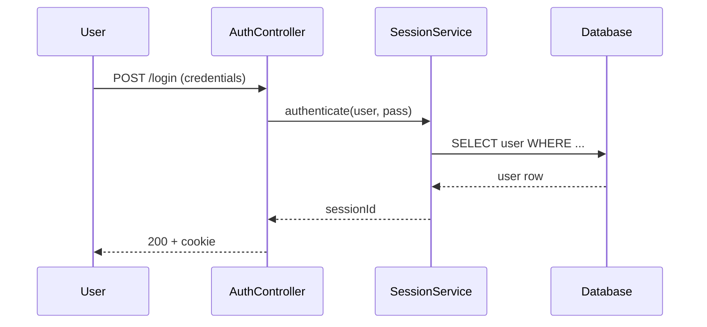

# День 35 — Codebase Explorer: план реализации (БЕЗ имплементации)

> **Статус:** план/анализ. Реализация НЕ выполняется в рамках текущей задачи (по решению пользователя —
> оставить день 35 как design-only, «не реализовывать»).
>
> **Дата плана:** 2026-07-18. **Автор:** cli-agent swarm (неделя 7).

## 1. Постановка задачи

**Codebase Explorer** — автономный AI-продукт, который по URL/пути git-репозитория строит
интерактивную «карту» кодовой базы: архитектуру, data flow, entry points. Пользователь может
задавать вопросы о чужом (или своём) коде и получать trace-ответы с mermaid-диаграммами и ссылками
на файлы/строки.

**Аналоги:** Cursor (для чтения, не записи), Sourcegraph Cody,_GREP AI. Наша фишка — автономность:
agent сам исследует код (sub-agents fan-out по модулям), строит RAG-индекс, генерирует визуализации.

**Проблема (pain):** онбординг в чужой опенсорс-проект занимает часы/дни. Codebase Explorer сокращает
это до минут: задаёшь вопрос → получаешь ответ с архитектурной диаграммой и trace.

## 2. Пользовательские сценарии (use cases)

1. **Онбординг:** «Как устроена аутентификация в этом проекте?» → trace вызовов + mermaid sequence.
2. **Аудит:** «Найди все точки входа (public API)» → список endpoints/functions с зависимостями.
3. **Реверс-инжиниринг:** «Как данные попадают из UI в БД?» → data-flow diagram.
4. **Поиск:** «Где используется `PaymentService`?» → grep + граф зависимостей.
5. **Сравнение:** «Чем этот форк отличается от upstream?» → diff-анализ + summary.

## 3. High-level архитектура

```
┌─────────────────────────────────────────────────────────────┐
│                    Codebase Explorer                         │
│  cli-agent codebase-explore <repo-url|path>                  │
└─────────────────────────────────────────────────────────────┘
                              │
        ┌─────────────────────┼─────────────────────┐
        ▼                     ▼                     ▼
┌──────────────┐    ┌──────────────────┐    ┌──────────────────┐
│  Ingestion   │    │  RAG Indexer     │    │  Explorer Agent  │
│              │    │                  │    │                  │
│ git clone /  │    │ AST parse →      │    │ Sub-agents       │
│ parse files  │    │ chunks →         │    │ (fan-out по      │
│ detect lang  │    │ embeddings →     │    │  модулям)        │
│              │    │ vector store     │    │                  │
└──────┬───────┘    └────────┬─────────┘    └────────┬─────────┘
       │                     │                       │
       └─────────────────────┼───────────────────────┘
                             ▼
                   ┌──────────────────┐
                   │  Interactive Q&A │
                   │  (REPL / web UI) │
                   │                  │
                   │  mermaid render  │
                   │  file:line links │
                   └──────────────────┘
```

## 4. Стек (в рамках инвариантов проекта)

| Компонент | Технология | Обоснование |
|-----------|------------|-------------|
| Язык | Kotlin (JVM 21) | инвариант проекта |
| Build | Gradle + Kotlin DSL, новый модуль `:codebase-explorer` | зеркало `:support-app` |
| CLI | clikt 4.4.0 | как все команды cli-agent |
| AST-парсинг | **JetBrains PsiViewer / kotlin-compiler-embeddable** | точный AST Kotlin/Java; для других языков — tree-sitter |
| RAG | переиспользование `rag/` (RagIndexer, RagRetriever) | недели 5-6 готовы |
| Embeddings | OllamaEmbeddingClient (nomic-embed-text) | локально, без API-key |
| LLM | multi-provider (z.ai / Ollama / openai-compatible) | LlmClientFactory |
| Mermaid | mermaid-cli (npm) или mermaid.js в web UI | рендер диаграмм |
| Sub-agents | swarm-паттерн (`agent/swarm/`) | неделя 4 готова |
| Storage | JSON files (RAG index) + опц. SQLite для graph cache | XDG-пути |

## 5. Модули и файлы (детальный план)

### 5.1 Новый Gradle-модуль `:codebase-explorer`

Зеркало `:support-app/build.gradle.kts`:
```kotlin
plugins { kotlin("jvm"); kotlin("plugin.serialization"); application; id("com.gradleup.shadow") }
dependencies {
    implementation(project(":"))   // ContextAwareAgent, RagRetriever, LlmClientFactory
    implementation("io.ktor:ktor-server-core:3.4.3")  // для опционального web UI
    // AST: kotlin-compiler-embeddable для .kt, tree-sitter для прочих языков
    implementation("org.jetbrains.kotlin:kotlin-compiler-embeddable:2.3.21")
}
```

### 5.2 Ingestion pipeline

**`IngestionPipeline.kt`** — оркестратор:
1. `RepoSource.resolve(url|path)` → клонировать (git) или использовать локальный путь.
2. `LanguageDetector.detect(root)` → определить языки (по расширениям: .kt, .java, .py, .ts...).
3. `FileWalker.walk(root, filter)` → собрать исходники (фильтр build/.git/node_modules).
4. `AstParser.parse(files)` → извлечь symbols (классы, функции, imports).
5. `DependencyGraph.build(symbols)` → граф импортов/вызовов.

**Ключевые классы:**
```kotlin
data class CodeSymbol(
    val name: String,
    val kind: SymbolKind,        // CLASS, FUNCTION, PROPERTY, IMPORT
    val filePath: String,
    val lineStart: Int,
    val lineEnd: Int,
    val signature: String?,      // для функций
    val docComment: String?,
)

data class DependencyEdge(
    val from: String,            // symbol fqName
    val to: String,
    val kind: EdgeKind,          // IMPORTS, CALLS, IMPLEMENTS, EXTENDS
)

class DependencyGraph(
    val symbols: Map<String, CodeSymbol>,
    val edges: List<DependencyEdge>,
) {
    fun callersOf(symbol: String): List<CodeSymbol>
    fun calleesOf(symbol: String): List<CodeSymbol>
    fun subgraph(root: String, depth: Int): DependencyGraph   // для trace
}
```

### 5.3 RAG-индексация кода

Переиспользование `RagIndexer` + `StructuralChunker`, но с расширением `DocumentLoader` для
поддержки .java, .py, .ts (сейчас только .md, .kt).

```kotlin
class CodebaseRagIndexer(
    private val root: File,
    private val graph: DependencyGraph,
    private val embedder: EmbeddingClient,
) {
    suspend fun index(): RagIndex   // + метаданные symbolId в каждом chunk
    suspend fun retrieveWithGraph(query: String, topK: Int): List<ScoredChunk>
}
```

### 5.4 Explorer Agent (sub-agents fan-out)

По паттернам недели 7 (лекция): **Fan-out** — оркестратор запускает субагентов по модулям.

```kotlin
class ExplorerAgent(
    private val graph: DependencyGraph,
    private val ragRetriever: CodebaseRagIndexer,
    private val llmClient: LlmClient,
    private val model: String,
) {
    suspend fun explore(question: String): ExplorationResult {
        // 1. Router: классифицировать вопрос (architecture / dataflow / search / compare)
        // 2. Fan-out sub-agents:
        //    - ArchitectureAgent: читает README/AGENTS/docs, строит high-level diagram
        //    - TraceAgent: идёт по dependency graph, строит call/dataflow trace
        //    - SearchAgent: grep + RAG по исходникам
        // 3. Integrate: мердж результатов в единый ответ с mermaid + file:line ссылками
    }
}
```

### 5.5 CLI-команда

```bash
cli-agent codebase-explore <repo-url|path> [--lang kt,java] [--no-clone] [--web]
```

- `--lang` — ограничить языки для парсинга (default: auto-detect).
- `--no-clone` — для локального пути без git clone.
- `--web` — запустить web UI (Ktor) для интерактивного Q&A; иначе — REPL.

### 5.6 Mermaid-генерация

LLM генерирует mermaid-синтаксис в ответе; рендеринг:
- **CLI:** `mermaid-cli` (mmdc) через ProcessBuilder → PNG/SVG, открывается в браузере.
- **Web:** mermaid.js (CDN) рендерит inline в HTML.

Пример: question «как работает auth?» →


## 6. Метрики (лекция нед.7 — обязательны для production)

| Метрика | Как замерять | Target |
|---------|--------------|--------|
| **Latency** (P95) | время от вопроса до ответа | < 30s (small repo), < 120s (large) |
| **Cost** | токены на один explore-сеанс | < 50K tokens |
| **Quality** | human rating 1-10 на trace-точность | P80 ≥ 7 |
| **Success rate** | доля ответов без «не знаю» | > 70% |

Baseline замеряется на эталонных репозиториях (этот же cli-agent + 2-3 известных опенсорса).

## 7. Error handling & fallback (лекция нед.7)

- **AST-парсинг упал** (нестандартный синтаксис) → fallback на regex-based extraction.
- **Embedder недоступен** (Ollama оффлайн) → ответ без RAG, только по dependency graph.
- **LLM-таймаут** → retry с упрощённым промптом; 2-я попытка — на другой модели (cloud fallback).
- **Слишком большой репо** (> 10K файлов) → инкрементальная индексация по подкаталогам + warning.

## 8. Human-in-the-Loop

- `codebase-explore` сам по себе read-only (не пишет в целевой репо) — подтверждения не требует.
- Если добавить `--apply-suggestions` (генерация патчей) → dangerous op, нужен confirm (как день 34).

## 9. Риски и unknowns

| Риск | Mitigation |
|------|------------|
| kotlin-compiler-embeddable тяжёлый (~50MB JAR) | вынести AST в отдельный shadowJar; или использовать lighter PsiViewer |
| Tree-sitter JNI complexity | MVP — только Kotlin/Java через JetBrains AST; Python/TS — Phase 2 |
| Дублирование с已有 `ask` (день 31) | day-31 — RAG над docs; codebase-explorer — AST + graph + trace (глубже) |
| Производительность на крупных репо | инкрементальная индексация + кеш graph в SQLite |

## 10. Phases (roadmap)

**Phase 1 (MVP, ~1-2 дня):**
- Kotlin-only AST (kotlin-compiler-embeddable)
- Dependency graph (imports + calls)
- RAG-индексация исходников
- CLI REPL с Q&A, mermaid в ответе (без рендера)

**Phase 2 (web UI + multi-language):**
- Web UI (Ktor + mermaid.js)
- Tree-sitter для Python/TypeScript/Go
- Инкрементальная индексация

**Phase 3 (production):**
- Метрики (latency/cost/quality dashboard)
- Кеш graph в SQLite
- GitHub Action для автоматических ADR/architecture-doc генерации

## 11. Связь с концепциями недели 7

| Концепция лекции | Применение в codebase-explorer |
|------------------|-------------------------------|
| **LLM Agent как мини-ОС** | Agent сам исследует код через tools (AST, RAG, graph), как Cursor/claude-code |
| **Субагенты (Fan-out)** | По одному агенту на модуль/язык, параллельный анализ |
| **Tool Registry + Executor** | read_file, find_in_files (из дня 34) + ast_symbols, graph_trace (новые) |
| **AI Pipeline** | clone → AST → RAG → graph → explore → ответ (trigger: команда пользователя) |
| **Метрики** | latency/cost/quality — замеряются и трекаются |
| **Error handling** | retry/fallback при падении AST/embedder/LLM |

## 12. Решение пользователя

> **День 35 НЕ реализовывать** в рамках текущей задачи (неделя 7). Достаточно провести анализ и
> составить план. Этот документ — итог анализа. Реализация — отдельная задача (Phase 1 roadmap).

Причина: дни 31-34 уже покрыли все ключевые концепции недели 7 (RAG, MCP tools, pipeline, dangerous
ops, sub-agents паттерн). Codebase-explorer — естественное расширение, но объёмная задача (AST,
graph algorithms, mermaid), выходящая за рамки «демонстрации концепций недели».
